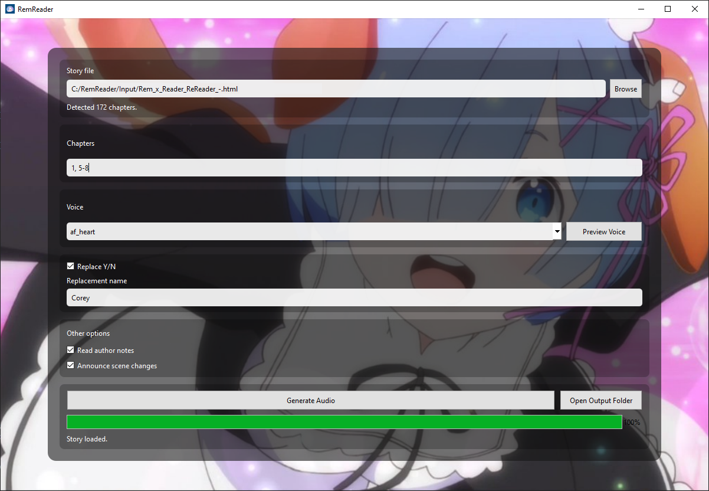

#RemReader

> RemReader is an AO3 fanfiction audiobook generator.

Give RemReader a downloaded AO3 HTML file and it will parse the story,
process the text, and generate each selected chapter as a WAV audio file

Designed to be lightweight, easy to use and easy to understand

> **NOTE:** Some features may be experimental (E) so expect bugs!

**Rem is best girl 💙**

---

*HOW TO USE*

- Run RemReader
- Select a downloaded AO3 HTML file
- Wait for the story to load (large stories may take some time)
- Enter the chapters you want to generate
  - Examples: "1", "1-5", or "1, 3, 5-8"
- Select a voice (or leave the default)
- Use "Preview Voice" to hear the selected voice
- Optionally replace Y/N with your name (for xReader fics)
- Select your other reading options
- Click "Generate Audio"
- Wait for the audio to generate (this may take some time)
- Click "Open Output Folder" to find your finished audio

Generated files are saved in the "Output" folder.

**Rem is best girl 💙**

---

*CURRENT FEATURES*

- Automatic AO3 chapter detection
- Multiple chapter selection
- Kokoro text-to-speech
- Multiple voices
- Voice previews
- Y/N name replacement
- Optional author notes
- Spoken scene changes
- Generation progress and ETA
- Automatic story and chapter filenames

**Rem is best girl 💙** 

---

*NOTES*

RemReader is currently under development.

Generation speed depends heavily on your computer's hardware.
The first TTS generation may also take longer while required model files
are downloaded.

More input formats and features are planned for the future.

**Rem is best girl 💙**
